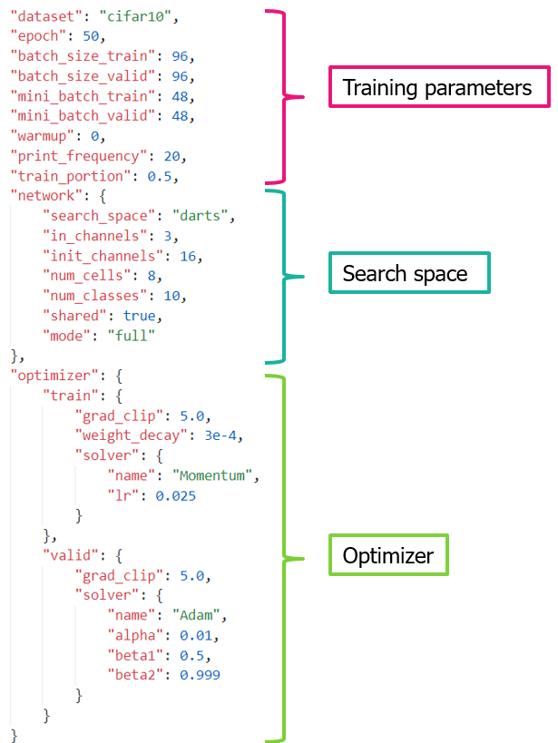

Experiments
===========

NNablaNAS has command line interface utility:

::

    usage: main.py [-h] [--context CONTEXT] [--device-id DEVICE_ID]
                [--type-config TYPE_CONFIG] [--search]
                [--algorithm {DartsSearcher,ProxylessNasSearcher,Trainer}]
                [--config-file CONFIG_FILE] [--output-path OUTPUT_PATH]

    optional arguments:
    -h, --help            show this help message and exit
    --context CONTEXT, -c CONTEXT
                            Extension module. 'cudnn' is highly.recommended.
    --device-id DEVICE_ID, -d DEVICE_ID
                            A list of device ids to use, e.g., 0,1,2. This is only valid if you
                            specify `-c cudnn`.
    --type-config TYPE_CONFIG, -t TYPE_CONFIG
                            Type configuration.
    --search, -s          Whether search algorithm is performed.
    --algorithm {DartsSearcher,ProxylessNasSearcher,Trainer}, -a {DartsSearcher,ProxylessNasSearcher,Trainer}
                            Algorithm used to run
    --config-file CONFIG_FILE, -f CONFIG_FILE
                            The configuration file used to run the experiment.
    --output-path OUTPUT_PATH, -o OUTPUT_PATH
                            Path monitoring logs saved.

To run an experiment with NNablaNAS, one should create a configuration file (in ``json`` format). Below is an example of how this configuration file look like.

You can start architecture search using `DartsSearcher` by the command below

::

    python main.py -d 1 --search \
               -f examples/darts_search.json  \
               -a DartsSearcher \
               -o log/darts/search

The retraining script can be used as 

:: 

    python main.py -d 1 \
               -f examples/darts_train.json \
               -a Trainer -o log/darts/train

NNablaNAS also supports multi GPUs. More information can be found `<here https://nnabla.readthedocs.io/en/latest/python/tutorial/multi_device_training.html>`_. Below is an example of searching an architecture with 4 GPUs.

:: 

    mpirun -n 4 main.py -d 0,1,2,3 --search \
               -f examples/darts_search.json  \
               -a DartsSearcher \
               -o log/darts/search
