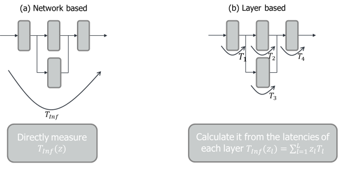

Estimating the Latency of DNN Architectures
-------------------------------------------

Hardware aware NAS addresses the problem, how to fit the architecture of DNNs to specific target devices,
such that they fulfill given performance requirements. This is, for example, important if we want to deploy
DNN based algorithms to mobile devices. Naturally, we want to find DNN architectures that run fast and require 
only little memory. More specifically, we might be interested in DNNs that have

- a low latency.
- a small parameter memory footprint.
- a small activation memory footprint.
- a high throughput.
- a low power consumption.

To perform hardware aware NAS, we, therefore, need tools to estimate such performance measures on target devices. 
The modules inside nnabla_nas.utils.estimator.latency implement
such tools, i.e., they provide methods to estimate the latency and the memory footprint 
of DNN architectures. 

How to estimate the latency of DNN architectures
................................................

There are different ways how to estimate the latency of a DNN architecture on the device. 
Two naive ways how to do it are given in the figure below, namely

- network-based estimation
- layer-based estimation

Here, z is a random vector which encodes the structure of the network.
A network-based latency estimator instantiates and measures the time it takes to calculate
the output of the computational graph at once. We call the resulting latency the true latency.
A layer-based estimator instantiates the computational graph and estimates the latency of 
each layer separately. The latency of the whole network is calculated as the sum of all the
latencies from the individual layers. We call this the accumulated latency. Because the individual
calculation of each layer causes some computational overhead, the layer-based latency estimate
is not the same as the true latency. However, experiments show that the differences between
the true and the accumulated latency estimates are small, meaning that both can be used for hardware aware NAS.

In the NNabla NAS framework, we only implemented layer-based latency estimators:

- *nnabla_nas.utils.estimator.latency.LatencyEstimator*: a layer-based estimator that extracts the layers of the network based on the active modules contained in the network
- *nnabla_nas.utils.estimator.latency.LatencyGraphEstimator*: a layer-based estimator that extracts the layers of the network based on the NNabla graph of the network

The reason for this is that we want the estimators to run offline, i.e., before the architecture search.
Depending on the target hardware, a latency measurement on a device can take considerable time. Therefore,
latency measurements during architecture search are not desirable. 
With network-based estimators, the number of networks to measure grows exponentially with the number of 
layers and the number of candidates per layer. However, with the layer-based approach, the growth is only linear.

However, you can try and use the network-based latency estimator from NNabla, which we make available at 
*nnabla_nas.utils.estimator.latency.Profiler*

How to use the estimators
.........................

The following example shows how to use an estimator. First, we instantiate the model we want to estimate the latency of. 
To this end, in this example, we borrow the implementation of the MobileNet from :ref:`mobilenet`. If the network
is constructed from dynamic modules (as in this case), the NNabla graph must be constructed once, such that each
module knows its input shapes. We can then feed the model to the estimator to calculate the latency. Please note that
the estimator always assumes a batch size of one. Further, the model will always be profiled with the input shapes 
that have been calculated when the last NNabla graph was created.

.. code-block:: python

    from nnabla_nas.contrib.classification.mobilenet import SearchNet
    from nnabla_nas.utils.estimator.latency import LatencyGraphEstimator, LatencyEstimator
    import nnabla as nn
    from nnabla.ext_utils import get_extension_context

    # Parameters for the Latency Estimation
    outlier = 0.05
    max_measure_execution_time = 500
    time_scale = "m"
    n_warmup = 10
    n_runs = 100
    device_id = 0
    ext_name='cudnn'

    ctx = get_extension_context(ext_name=ext_name, device_id=device_id)
    nn.set_default_context(ctx)

    layer_based_estim_by_module = LatencyEstimator(
        device_id=device_id, ext_name=ext_name, outlier=outlier, time_scale=time_scale, n_warmup=n_warmup,
        max_measure_execution_time=max_measure_execution_time,n_run=n_runs
        )

    layer_based_estim_by_graph = LatencyGraphEstimator(
        device_id=device_id, ext_name=ext_name, outlier=outlier, time_scale=time_scale, n_warmup=n_warmup,
        max_measure_execution_time=max_measure_execution_time,n_run=n_runs
        )

    # create the network
    net = SearchNet()

    # For *dynamic graphs* like MobileNetV2, we need to create the nnabla graph once 
    # This defines the input shapes of all modules
    inp = nn.Variable((1,3,32,32))
    out = net(inp)

    layer_based_latency_by_m = layer_based_estim_by_module.get_estimation(net)
    layer_based_latency_by_g = layer_based_estim_by_graph.get_estimation(out)

The two results differ just because the estimation is carried out two separate times,
for each different layer found. Conceptually, both estimations should be identical.

Please note: if the candidate space contains zero modules, the estimate can deviate considerably
if the model is constructed from *dynamic* modules. To make this clearer, we continue the code example from above:

.. code-block:: python

    inp2 = nn.Variable((1,3,1024,1024))
    out2 = net(inp2)
    layer_based_latency_by_m2 = layer_based_estim_by_module.get_estimation(net)
    layer_based_latency_by_g2 = layer_based_estim_by_graph.get_estimation(out2)

Because we constructed a second NNabla graph (out2) that has a much larger input, the input shapes of all modules
in the network will be changed accordingly. Therefore, these later latencies will be much larger than the previously
measured latencies. 

Profiling *static* graphs is similar. The only difference is that the input shapes of
static modules cannot change after instantiation, meaning that we do not need to construct the NNabla 
graph before latency estimation.

As a further example, you can also use the network-based estimator (Profiler) by continuing the code above:

.. code-block:: python

    from nnabla_nas.utils.estimator.latency import Profiler
    network_based_estim = Profiler(out2,
        device_id=device_id, ext_name=ext_name, outlier=outlier, time_scale=time_scale, n_warmup=n_warmup, 
        max_measure_execution_time=max_measure_execution_time,n_run=n_runs
    )
    network_based_estim.run()
    net_based_latency = float(network_based_estim.result['forward_all'])