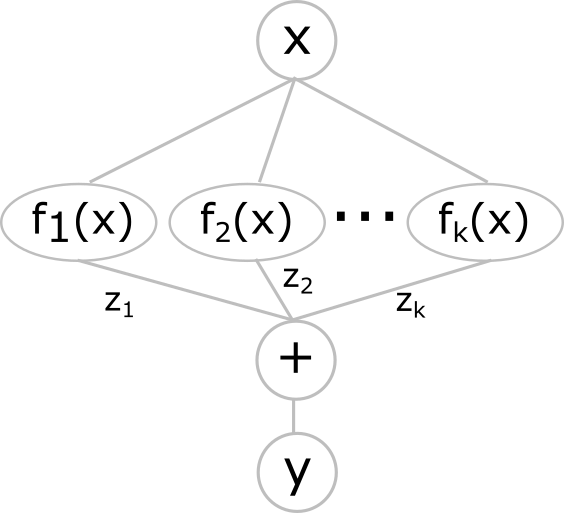

.. _nas_algorithms:

NAS Algorithms
----------------

While multiple different NAS algorithms have been proposed in the past, NNablaNAS implements only two of them, namely DARTS and ProxylessNAS. In the past, DARTS has shown impressive results on CIFAR10. Furthermore,  the algorithm is very simple. However, DARTS also has some drawbacks. It requires a lot of memory and has a very high computational complexity. As described later in detail, DARTS instantiates a superposition of all possible networks in the search space. Because the computational complexity to evaluate a superposition of all networks within the search space can be very high, DARTS cannot be used to search for architectures in large search spaces or on large datasets like Imagenet. ProxylessNAS addresses this problem and instantiates only a few candidate networks from the search space at once. This greatly improves memory efficiency. However, it comes at the cost of slower convergence of the algorithm. 

Consider the simple example search space in the following Fig. 1. The input of the search space is :math:`x`. The input is passed to :math:`K` candidate functions :math:`f_k(x, \theta_k)` with model parameters :math:`\theta_k`. The output of each candidate function is weighted with a binary architecture weight :math:`z_k \in \{0,1\}`. Here, :math:`\sum_{k=1}^K z_k =1`, i.e., only one candidate function can be selected at a time. The result then is accumulated to calculate the output

.. math::

    y = \sum_{k=1}^K z_k f_k(x; \theta_k)

    
    
**Fig. 1.** A simple example search space.

NAS tries to optimize the architecture weights :math:`z_1, z_2, ..., z_K`, such that the test accuracy of the network is maximized. This results in the well-known bi-level optimization problem

.. math::

    \underset{z}{\arg\min} &\quad \mathcal{L}_{\text{val}} (\theta^{*}; z) \\
    \text{s.t.} & \quad \theta^{*}|z = \underset{\theta}{\arg\min} \; \mathcal{L}_{\text{train}} (\theta; z),

where :math:`\mathcal{L}_{\text{train}}` and :math:`\mathcal{L}_{\text{val}}` denote the training and validation loss function, respectively and :math:`z = [z_1, z_2, ..., z_K]^T` is the architecture parameter vector. Solving this problem is challenging because of two reasons. Computing the optimal model parameters :math:`\theta^{*}|z` for a given architecture parameter vector :math:`z` means that we need to train a DNN until convergence. Depending on the network and dataset size, this might take hours to days. Furthermore, finding the optimal architecture parameter vector itself is a combinatorial optimization problem that is very complex to solve if the number of candidate functions increases (regardless of how much time it takes to find :math:`\theta^{*}|z`). A good overview paper about NAS is [Elsken2018]_. Please have a look API documentation :ref:`darts-label` and :ref:`pnas-label` for further details on how to use the DARTS and PNAS algorithms of NNablaNAS, respectively.

Both DARTS and PNAS simplify the optimization problem to solve it. In the following sections, we give a summary of both algorithms and the assumptions they make. For details, we refer to the original publications
[liu2018]_ and [Cai2018]_. 

Rather than solving the bi-level optimization problem given above, both DARTS and PNAS use a pin-pong optimization scheme. Instead of training a model until convergence to obtain :math:`\theta^{*}|z` and then
updating  :math:`z` they alternate between architecture and model parameter updates, i.e., they compute

.. math::

    z^{t+1} &= \underset{z}{\arg\min} \quad \mathcal{L}_{\text{val}} (\theta^t; z) \\
    \theta^{t+1}|z^t &= \underset{\theta}{\arg\min} \; \mathcal{L}_{\text{train}} (\theta; z^t),
    
what eliminates the bi-level optimization problem. 
However, optimization of :math:`z` is still a combinatorial problem.
DARTS and PNAS address this problem in two different ways.

DARTS
.....

In the case of DARTS, we use a continuous relaxation of the optimization problem, i.e., we define

.. math::

    z = \mathrm{softmax}(\alpha),

where :math:`\alpha \in \mathbb{R}^{K}` are real architecture parameters. Hence, the output of the search space

.. math::

    y = \sum_{k=1}^K [\mathrm{softmax}(\alpha)]_k f_k(x; \theta_k)
    
is differentiable with respect to :math:`\alpha` and we can use gradient-based optimization. Note, if we would use a softmax function with a temperature term :math:`z = \mathrm{softmax}(\alpha, T)` and would take the limit of :math:`T \rightarrow 0`, we would recover the original combinatorial optimization problem. However, a drawback of DARTS is, that all candidates :math:`f_k(\cdot)` must be evaluated, which requires lots of calculations and memory.

Proxyless NAS (PNAS)
..............................

PNAS addresses this problem differently. Instead of solving the original combinatorial optimization problem, PNAS assumes that the architecture weights are stochastic and optimizes the expected accuracy, i.e.,

.. math::

    \alpha^{t+1} &= \underset{\alpha}{\arg\min} \quad E_{z \sim p(z;\alpha)} [\mathcal{L}_{\text{val}} (\theta^t; z)] \\
    z &\sim \mathrm{Categorical}(z; \alpha).
    
Because the sampling from a categorical distribution is not differentiable, PNAS uses reinforce updates, i.e., it estimates the gradient :math:`\partial_{\alpha} E_{z \sim p(z;\alpha)} [\mathcal{L}_{\text{val}} (\theta^t; z)]`, using the score-function estimator

.. math::

    \partial_{\alpha} E_{z \sim p(z;\alpha)} [\mathcal{L}_{\text{val}} (\theta^t; z)] = E_{z \sim p(t;\alpha)} [\mathcal{L}_{\text{val}} (\theta^t; z) \partial_{\alpha} \mathrm{ln}p(z;\alpha)].

.. rubric:: References

.. [liu2018] Liu, Hanxiao, Karen Simonyan, and Yiming Yang. "Darts: Differentiable architecture search." arXiv preprint arXiv:1806.09055 (2018).

.. [Elsken2018] Elsken, Thomas, Jan Hendrik Metzen, and Frank Hutter. "Neural architecture search: A survey." arXiv preprint arXiv:1808.05377 (2018).

.. [Cai2018] Cai, Han, Ligeng Zhu, and Song Han. "Proxylessnas: Direct neural architecture search on target task and hardware." arXiv preprint arXiv:1812.00332 (2018).
