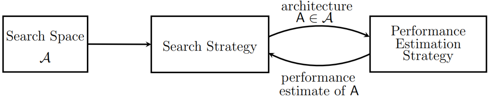
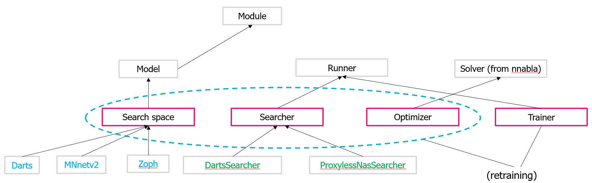

============
Introduction
============

The success of Deep Neural Networks (DNNs) is due to their ability to automate the feature engineering process. This success has been shown in many tasks, including s image recognition, speech recognition, and machine translation.  The choice of network architecture is a particularly important step when we design DNN based machine learning algorithms. A network architecture is a description of which layers are used in a DNN, how each layer is parametrized and how the layers are connected. Commonly known classes of network architectures are for example feed-forward DNNs, recursive DNNs, ResNets, Inception networks or MobileNets.

By improving the DNN architecture such that it is tailored specifically to one given task,  we can further increase the performance of deep learning models [Elsken2018]_. However, most of the neural architectures are designed manually. This is time-consuming, expensive and does not scale with an increasing number of new domains and learning tasks. A promising direction in automating machine learning is automating architecture engineering, the so-called *neural network architecture search* (NAS). Neural network architecture search is closely related to `hyperparameter optimization <https://en.wikipedia.org/wiki/Hyperparameter_optimization>`_ and is a subfield of `automated machine learning <https://en.wikipedia.org/wiki/Automated_machine_learning>`_ (AutoML). **NNablaNAS** is a framework for architecture search in computer vision domain. The main aim is to provide a modular, easy, and extendible toolbox for deep learning practitioners. In this section, an overview of the neural architecture search is introduced.

.. toctree::
    :maxdepth: 2

What is neural architecture search?
-----------------------------------

**Neural Architecture Search** is a technique in machine learning used to automatically learn neural network architectures for a given machine learning task. Let :math:`\theta` and :math:`\alpha` denote the model and network architecture parameters, NAS can be formulated as a bilevel optimization problem:

.. math::

    \underset{\alpha}{\arg\min} &\quad \mathcal{L}_{\text{val}} (\theta^{*}; \alpha) \\
    \text{s.t.} & \quad \theta^{*} = \underset{\theta}{\arg\min} \; \mathcal{L}_{\text{train}} (\theta; \alpha)

where :math:`\mathcal{L}_{\text{train}}` and :math:`\mathcal{L}_{\text{val}}` denote the training and validation loss function, respectively. The design of modern neural network architectures is driven by two different objectives [liu2018]_:

* The neural network should have a reasonably high capacity, i.e., the family of transfer functions contains arbitrary complex functions that can capture lots of information from training data. 

* Inference should be computationally efficient, i.e., inference only needs a small number of multiplication-accumulation (MAC) operations or low inference latency.

The design of a good neural architecture corresponds to find a good balance between those (often competing) requirements, by selecting and arranging layers in a meaningful way. 

Compared to the early days of Deep Learning, today, DNNs consist of a  broad variety of different network layers like *Linear*, *Convolutional*, *Dilated Convolutional*, *Group Convolutional*, *Separable Convolutional* (depth-wise, channel-wise, spatial), *Pooling*, *Skip Connect*, *Batch Normalization*, etc. Therefore, neural architecture design is a very large combinatorial problem which  is especially hard to solve, because we have only a poor (or almost no) understanding how a specific choice or arrangement of layers affects our requirements. The neural architecture search aims to automate architecture design and to directly learn the optimal architecture from the data. This has multiple benefits. We need no expert with lots of experience. We do not need to understand which effect a combination of certain layers yields to our requirements. NAS has the potential to come up with architectures which generalize much better to unseen data than humans because it can try out many more architectures at the same time. We can optimize the architectures to be resource-efficient.

**Fig. 1.** An overview of neural architecture search. (Image source: [Elsken2018]_)

The main components of NAS include:

- **Search space**: This defines which architectures or types of artificial neural networks can be used.

- **Search algorithm**: This defines approaches used to explore the search space.

- **Performance estimation strategy**: This evaluates the performance of a given architecture.

NAS Algorithms 
----------------

NAS is a combinatorial and therefore a computationally complex optimization problem. A variety of different NAS algorithms has been proposed in the past. To name a few, there are:

- **Reinforcement learning-based** NAS algorithms. The seminal paper about NAS proposed such a reinforcement learning approach.  Reinforcement learning-based algorithms use an actor that generates neural architectures. To this end, the actor follows a policy, which is optimized, such that the validation accuracy of the generated neural architectures is maximized.
  
- **Stochastic** NAS algorithms, which randomly generate neural architectures and keep the last best architecture.

- **Evolutionary Algorithm** (EA) based NAS algorithms. An EA uses mechanisms inspired by biological evolution, such as reproduction, mutation, recombination, and selection. Candidate solutions to the optimization problem play the role of individuals in a population, and the fitness function determines the quality of the solutions. The evolution of the population then takes place after the repeated application of reproduction, mutation, recombination, and selection. 
 
- **Bayesian Optimization** (BO) based algorithms. BO is a powerful optimization method to optimize non-differentiable black-box functions that are complex to evaluate. In the case of NAS, this function is the validation accuracy of a network architecture. It is very complex to evaluate because to calculate it we need to train a DNN until convergence.  
  
- **Differentiable NAS** algorithms like DARTS, which relax the optimization problem such that it becomes differentiable and can be solved with gradient-based optimization algorithms.

- **Proxyless NAS** (PNAS), which uses a ping-pong optimization scheme that switches between gradient descent based model parameter updates that minimize the training error and reinforce based architecture parameter updates that minimize the test error, i.e.,
  
  .. math::

    \max_{\alpha} &\quad \mathbb{E}_{z \sim p_{\alpha}(z)} \big[\text{score}(z, \Phi^{*})\big] \\
    \text{s.t.} & \quad \Phi^{*} = \underset{\Phi}{\arg \min} \quad \text{loss}(z, \Phi)

NNablaNAS implements DARTS and PNAS algorithms. Both report a good performance on multiple datasets. For a detailed description of the algorithms, we refer to section :ref:`nas_algorithms` or to the original papers [liu2018]_ and [Cai2018]_.

Code structure
---------------

The most fundamental source codes are in the `nnabla_nas folder <https://github.com/sony/nnabla-nas/tree/master/nnabla_nas>`_. See below for a high-level overview of the repository.

- `contrib <https://github.com/sony/nnabla-nas/-/tree/master/nnabla_nas%2Fcontrib>`_: Search spaces and neural architectures are defined in this folder.

- `dataset <https://github.com/sony/nnabla-nas/-/tree/master/nnabla_nas%2Fdataset>`_: Datasets related are implemented in this folder. NNablaNAS uses a dataloader to feed data into the model.

- `module <https://github.com/sony/nnabla-nas/-/tree/master/nnabla_nas%2Fmodule>`_: Most basic modules to define search spaces and to construct a neural network. 

- `optimizer <https://github.com/sony/nnabla-nas/-/tree/master/nnabla_nas%2Foptimizer>`_: Simple optimizers to update the parameters of the neural networks as well as architecture parameters.

- `runner <https://github.com/sony/nnabla-nas/-/tree/master/nnabla_nas%2Frunner>`_: Search and retraining algorithms are defined in this folder. Any new architecture search algorithm should follow the same API.

- `utils <https://github.com/sony/nnabla-nas/-/tree/master/nnabla_nas%2Futils>`_: Utilities functions related to logging, visualization, and profiling.

**Fig. 2.** A high-level API of the NNablaNAS framework.

