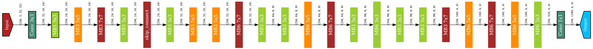

NNablaNAS examples
--------------------

NNablaNAS contains several examples including:
 * ``DARTS`` search space and search algorithm :cite:`liu2018darts`
 * ``Proxyless NAS`` (PNAS) :cite:`cai2018proxylessnas` algorithm with mobilenet search space
 * ``Zoph`` :cite:`zoph2016neural` search space (can be searched with DARTS or PNAS algorithms)
 * ``Randomly wired neural network`` :cite:`xie2019exploring`
 * ``FairNAS`` :cite:`Chu_2021_ICCV` rethinking evaluation fairness of weight sharing NAS
 * ``Once-for-All`` (OFA) :cite:`cai2019once` is only trained once, and we can quickly get specialized sub-networks from the OFA network without additional training.

The examples can be launched from a unique entry point ``./main.py`` and all the configurations for each of the experiment is predefined in a ``yaml`` file. The list of command lines to run the prepared examples can be found in ``./examples/jobs.sh``.

In this tutorial we will see how to run the examples and how you can modify the configurations to run your experiments.

We will show how to run and modify the so-called ``MobileNet`` example on CIFAR10. After running the example we advise to try the other examples on your own.

.. note::
    The command line for each example can be found in ./jobs.sh

Quick notice about Hydra
^^^^^^^^^^^^^^^^^^^^^^^^^^
Since we are using Hydra to deal with our configurations, you can check your experimental configuration without having to launch your experiment before hand, by using the following command::

    python main.py experiment=my_experiment --cfg job

You can also take a look at Hydra's more general configuration by typing::

    python main.py experiment=my_experiment --cfg hydra

The MobileNet search space
^^^^^^^^^^^^^^^^^^^^^^^^^^
In this example we use MobileNetV2 :cite:`sandler2018mobilenetv2` as a backbone to build the search space. In :cite:`sandler2018mobilenetv2`, the proposed architecture use fixed inverted bottleneck convolution with an expansion factor of 6 and a kernel size of 3x3. Furthermore, the number of inverted bottleneck convolution for each block with the same feature map size is defined. In this example, we want to add flexibility in the MobileNetV2 architecture to choose the depth for each block as well as the expansion factor and the kernel size for each inverted residual convolution.

We use the PNAS search algorithm to find a good architecture in this search space. Specifically, the algorithm can choose, for each layer, between different inverted residual convolution settings or to skip the layer (using identity module). Note that a similar experiment was performed in the original PNAS paper :cite:`cai2018proxylessnas`

Using NNablaNAS, we can find better architectures than the reference MobileNetV2 both for CIFAR10 and for ImageNet.

Running your first example
^^^^^^^^^^^^^^^^^^^^^^^^^^
.. note::
   Before starting you should get the NNablaNAS framework and install the dependencies. Please refer to the :ref:`installation` part of this documentation.

First, we will run the search with the default setting::

      python main.py experiment=classification/mobilenet/cifar10_search

We used the following arguments:
 * ``main.py`` is the entry script for all search and training examples.
 * ``experiment=mobilenet/cifar10_search`` is the experiment config file we want to use here. It contains all the information needed to run the experiment.

The command runs the search using the PNAS algorithm (it is set in the experiment config file), it will take several hours (around 12 hours depending on the GPU) to run. While it is running, let's have a look at the output path.
By default, we set Hydra to output the job result to log/classification/${name}/ with name being the name of the experiment, which can be found in the experiment config file.

In ``./log/classification/mobilenet/cifar10/search`` you will find the following files:
 * ``arch.h5`` it contains the best architecture so far.
 * ``arch.png`` to visualize the best architecture so far.
 * ``main.log`` contains the general log.
 * ``log.txt`` contains the search log.
 * ``/.YEAR-MONTH-DAY.hour-minutes-seconds`` contains the configuration files generated for this experiment, ie the job config, hydra config, and the eventual overrides (when an element from the config is modified through the command line).

Here is an example of a MobileNet architecture:

You can also monitor the search using the TensorBoard. To run the TensorBoard, use the following command:

::

    tensorboard --logdir=./log

Access your TensorBoard page using your browser at the given address (typically: `<http://localhost:6006/>`)

.. note::
    More details on TensorBoard can be found at `<https://www.tensorflow.org/tensorboard/>`_.

Once the search is finished, retrain the winning architecture from scratch using the same entry point python script::

   python main.py experiment=classification/mobilenet/cifar10_train

Note that, this time, we use the ``Trainer`` algorithm inside the experiment config file. The retraining will take several hours. You can monitor the training from your TensorBoard.

If you want to compare with the original implementation of MobileNetV2, just run::

  python main.py experiment=classification/mobilenet/cifar10_train_latency
 
Congratulations, you have performed your first neural architecture search using NNablaNAS. Now let's have a look at how to customize the search and training configuration. 

Search Configuration
^^^^^^^^^^^^^^^^^^^^

Without writing any python code, you can flexibly change the search configuration. Let's go through ``conf/experiment/mobilenet/cifar10_search.yaml``::

    defaults:
        - override /args: args.yaml
        - override /dataloader: cifar10.yaml
        - override /hparams: hparams.yaml 
        - override /optimizer: warmup.yaml
        - override /network: mobilenet_cifar10.yaml

The defaults list, when present in another file than the main configuration file config.yaml (as in this case, we are not in config.yaml), indicates the list of file we want to extend from. We can then redefine the values of the elements
they contain, or add new elements. These values can also be modified from the command line. This allows us to easily create new experiment files. 
The args.yaml file contains the following elements::

    context: cudnn
    device_id: '-1'
    type_config: float
    search: false
    algorithm: DartsSearcher
    output_path: '.' 
    save_nnp: false
    no_visualize: true

Which are partially overwritten in our config file by::

    args:
        search: true
        algorithm: ProxylessNasSearcher

Hence, the args part of our experiment config file in this case is::

    args:
        search: true
        algorithm: ProxylessNasSearcher
        context: cudnn
        device_id: '-1'
        type_config: float
        output_path: '.' 
        save_nnp: false
        no_visualize: true

Following the same logic for every file we extend from, our dataloader configuration is as follows::

    dataloader: 
        cifar10:
            train_portion: 0.9

These describe the dataset to be used; here it is CIFAR10. 
During the search, the training data is split into two parts. One part is used to train the model parameters and the other part is used to update the architecture parameters. ``train_portion`` sets the portion of the training sample that is used to train the parameters. 

Now let's have a look at the search space configuration (defined in mobilenet_cifar10.yaml which we extend from)::

   network: 
        mobilenet: 
            num_classes: 10
            settings: [
                [24, 4, 1],
                [32, 4, 1],
                [64, 4, 2],
                [96, 4, 1],
                [160, 4, 2],
                [320, 1, 1]
            ]
            mode: sample

``mobilenet`` is the name of the search space to be used. NNablaNAS contains several search spaces including ``darts``, ``zoph`` and ``mobilenet``. You can also prepare your own search space. Here we choose ``mobilenet`` and the following configurations are the arguments specific to this search space. ``num_classes`` is the number of the output of the classification network. ``settings`` defines the architecture backbone. Each line is a block of inverted residual convolutions with different feature sizes. The first column defines the number of feature maps for each block. The second column defines the maximum number of inverted residual convolutions for each block. The third column defines the stride used in the first inverted residual convolution of the block (this has the effect of reducing the feature map size). 

``mode`` should be set to ``sample`` for PNAS algorithm. 

In addition, the MobileNet search space has two important arguments call  ``candidates`` and ``skip_connect``, they define the choices for each inverted residual convolution. The example uses the default setting so they don't need to be explicitly set. The default setting is::

         "candidates" = [
                "MB3 3x3",
                "MB6 3x3",
                "MB3 5x5",
                "MB6 5x5",
                "MB3 7x7",
                "MB6 7x7"
            ]
        "skip_connect": true
  
``skip_connect`` defines if the inverted residual convolutions can be skipped giving the possibility to learn the depth of the network. 

``candidates`` defines the possible inverted residual convolution settings. The number after MB corresponds to the expansion factor and the kxk corresponds to the kernel size. 

Next, it is possible to set the optimizer arguments for the parameter training (defined in warmup.yaml which we extend from as our optimizer then modify)::

    optimizer: 
        train: 
            grad_clip: 5.0,
            weight_decay: 4e-5
            lr_scheduler: CosineScheduler
            name: Momentum,
            lr: 0.1
        valid: 
            grad_clip: 5.0
            name: Adam
            alpha: 0.001
            beta1: 0.5
            beta2: 0.999
        warmup: 
            grad_clip: 5.0
            weight_decay: 4e-5
            lr_scheduler: CosineScheduler
            name: Momentum
            lr: 0.1

Here we set three optimizers for warmup, training, validation. In PNAS The ``train`` and ``valid`` optimizers will train the models parameters and the architecture parameters respectively. Before starting updating the architecture, it is beneficial to warm up the model parameters. 

If ``grad_clip`` is specified, the gradients are clipped at the specified value.

If ``weight_decay`` is specified, weight decay will be used.

Finally, we set the general hyper-parameters for the search (again defined in hparams.yaml which we extend from then redefined)::

    hparams:
        epoch: 200
        input_shapes: [
            [3, 32, 32]
        ]
        target_shapes: [
            [1]
        ]
        batch_size_train: 128
        batch_size_valid: 256
        mini_batch_train: 128
        mini_batch_valid: 256
        warmup: 100
        print_frequency: 25

``epoch``, ``input_shape`` and ``target_shapes`` are self-explanatory. 

``batch_size_train`` is the batch size used for training and ``mini_batch_train`` specifies the number of examples transfer into the GPU at one time. The gradients of the ``mini_batch_train`` are accumulated before updating the model. Keep ``mini_batch_train`` to the same value of ``batch_size_train`` if you have enough GPU memory but it is useful to set a lower ``mini_batch_train`` so that the mini-batch can fit in GPU memory while still doing the update on a larger batch. ``batch_size_valid`` and ``mini_batch_valid`` set the corresponding batch size and mini-batch size for the validation. 

The number of warmup epoch is defined with the ``warmup`` argument.

``print_frequency`` sets how often the partial results are printed in the log file. 

Train Configuration
^^^^^^^^^^^^^^^^^^^^
Let's have a look at the MobileNet example ``conf/experiment/mobilenet/cifar10_train.yaml``. Most of the configuration parameters are the same as for the search yaml file. 
The only new configuration parameter is::

     genotype: log/classification/mobilenet/cifar10/search/arch.h5

``genotype`` is used to provide the path to the previously learn architecture (.h5 file).

.. bibliography:: ../bibtex/reference.bib
