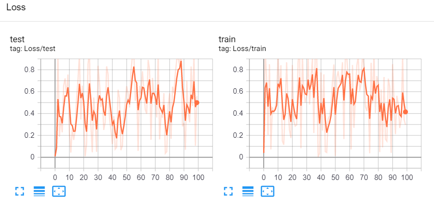
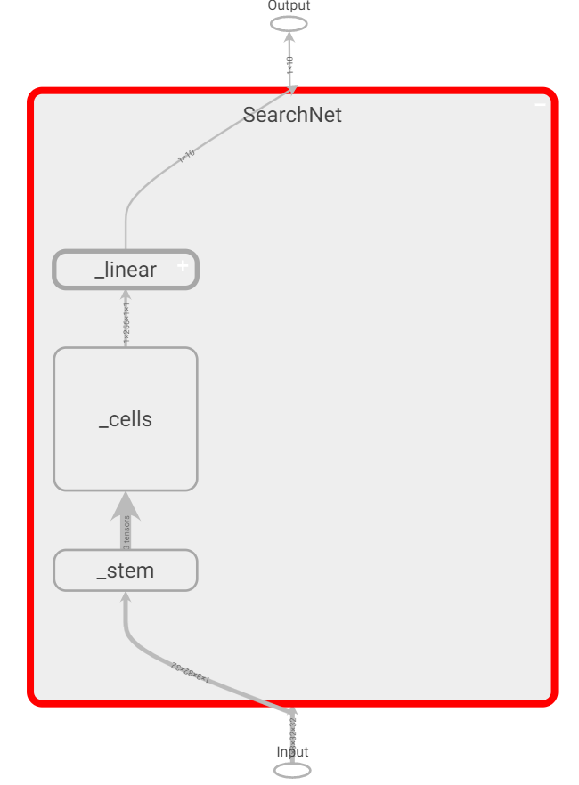

Logging and Visualization
-------------------------

``SummaryWriter`` is the main class to log data for visualization by TensorBoard. Training curves can be logged for each experiment. See the following example:

.. code-block:: python

    from nnabla_nas.utils.tensorboard import SummaryWriter
    import numpy as np

    writer = SummaryWriter('log')

    for n_iter in range(100):
        writer.add_scalar('Loss/train', np.random.random(), n_iter)
        writer.add_scalar('Loss/test', np.random.random(), n_iter)

    writer.close()

Expected output:

We can also inspect the model using TensorBoard. 

.. code-block:: python

    import nnabla as nn
    from nnabla_nas.contrib.darts import SearchNet
    from nnabla_nas.utils.tensorboard import SummaryWriter
    
    writer = SummaryWriter('log')

    # define the model
    net = SearchNet(3, 16, 3, 10)
    x = nn.Variable([1, 3, 32, 32])

    writer.add_graph(net, x)
    writer.close()

Expected output:

Please refer to the APIs :ref:`summary-label` for more information.