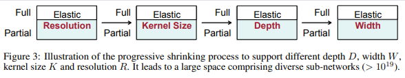

Once-for-All tutorial
---------------------

Once-for-All (OFA) :cite:`cai2019once` is only trained once, and we can quickly get specialized sub-networks from the OFA network without additional training.
The OFA architecture provides one model but supports a large number of sub-networks (>10^19) that covers various hardware platforms.
To efficiently train all the sub-networks, the progressive shrinking algorithm enforces the training order from large sub-networks to small sub-networks in a progressive manner.

We will show how to run ``OFA`` example on ImageNet.

.. note::
    The command line for each example can be found in ./jobs.sh

Progressive shrinking algorithm
^^^^^^^^^^^^^^^^^^^^^^^^^^^^^^^

In this example, we use MobileNetV3-Large :cite:`howard2019searching` based backbone to train the full network.
The full network includes sub-networks with different resolution, kenerl size, depth, and width expansion ratio.
OFA's progressive shrinking algorithm gradually increases the target sub-networks.

In NNablaNAS, progressive shrinking can be performed by running the training with different set of sub-networks in a progressive manner.

Here are the running scripts found in ``./jobs.sh``. ::

    mpirun -n 8 python main.py experiment=classification/ofa/ofa_mbv3/imagenet_search_fullnet

    mpirun -n 8 python main.py experiment=classification/ofa/ofa_mbv3/imagenet_search_kernel

    mpirun -n 8 python main.py experiment=classification/ofa/ofa_mbv3/imagenet_search_depth_phase1

    mpirun -n 8 python main.py experiment=classification/ofa/ofa_mbv3/imagenet_search_depth_phase2

    mpirun -n 8 python main.py experiment=classification/ofa/ofa_mbv3/imagenet_search_expand_phase1

    mpirun -n 8 python main.py experiment=classification/ofa/ofa_mbv3/imagenet_search_expand_phase2

Each stage uses weights trained in the previous stage for initialization.

For example, the network configuration for ``elastic kernel`` stage looks like this::

    network:
        ofa:
            num_classes: 1000
            bn_param: [0.9, 1e-5]
            drop_rate: 0.1
            op_candidates: ["MB6 7x7", "MB6 5x5", "MB6 3x3"]
            depth_candidates: [4]
            weights: log/classification/ofa/imagenet/search/K7_E6_D4/weights.h5

You can also train CompOFA sub-networks that was produced in :cite:`sahni2021compofa` by using the ``mpirun -n 8 python main.py experiment=classification/ofa/ofa_mbv3/imagenet_search_comp_phase1``
then ``mpirun -n 8 python main.py experiment=classification/ofa/ofa_mbv3/imagenet_search_comp_phase2``.
CompOFA simplifies the OFA model design space while maintaining Pareto optimaly; you can almost half the training time.

The example of network configuration for ``CompOFA`` looks like this::

    network:
        ofa:
            num_classes: 1000
            bn_param: [0.9, 1e-5]
            drop_rate: 0.1
            op_candidates: [
                "MB3 3x3", "MB3 5x5", "MB3 7x7", 
                "MB4 3x3", "MB4 5x5", "MB4 7x7", 
                "MB6 3x3", "MB6 5x5", "MB6 7x7"
            ]
            depth_candidates: [2, 3, 4]
            compound: true
            weights: ofa_sample_params/ofa-mbv3/R_K7_E6_D4_acc0.75968.h5

Train Configuration
^^^^^^^^^^^^^^^^^^^^
Once the model is trained, you can fine-tune sub-networks to further improve their performance.
Let's have a look at the example ``python main.py experiment=classification/ofa/ofa_mbv3/imagenet_train_subnet --cfg job``.
Most of the configuration parameters are the same as for the search yaml file.
The only new configuration parameter is::

    genotype: [5, 2, 9, 9, 6, 4, 2, 1, 7, 7, 8, 9, 8, 3, 9, 9, 8, 4, 3, 1]

``genotype`` is used to provide the architecture configuration for the sub-network you wish to fine-tune.
This can be created by using the operater candidate indices(zero-based indexing). Index: length(op_candidates) (a.k.a. 9 in this case) means skip connection.
For example, if your operater candidates are as follows::

    op_candidates: [
            "MB3 3x3", "MB3 5x5", "MB3 7x7",
            "MB4 3x3", "MB4 5x5", "MB4 7x7",
            "MB6 3x3", "MB6 5x5", "MB6 7x7"
        ],

The above genotype means::

    ["MB4 7x7", "MB3 7x7", skip_connect, skip_connect, "MB6 3x3", ...]

