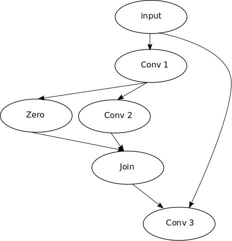

Overview of Static Modules
--------------------------

Besides (dynamic) modules NNablaNAS offers static_modules, i.e.,
modules that can be used to define static computational graphs.
Although the dynamic network graph implementation has proven to
be a powerful tool for many deep learning applications,
it lacks some features that are needed for
hardware aware neural architecture search.

With dynamic network graphs, the graph structure is completely defined
in the code, but not encoded in the data structure. Therefore, a dynamic graph
definition is not the natural choice if we need to define functions that
need knowledge about the graph structure. Consider the following code example
that defines a simple d layer CNN:

.. code-block:: python

   from nnabla_nas import module as Mo
   import nnabla as nn
   inp = nn.Variable((10, 3, 32, 32))
   def net(x, d=10):
      c_inp = Mo.Conv(3, 64, (3,3))
      c_l = [Mo.Conv(64, 64, (3,3)) for i in range(d-1)]
      x = c_inp(x)

      for i in range(d-1):
         x = c_l[i](x)
      return x

   out = net(inp)

The network consists of 10 convolutional layers, with a 3x3 kernel. Each layer
computes 64 feature maps. Following the dynamic graph paradigm,
the structure of the network is only defined in the code, i.e., it is only defined
by the sequence in which we apply the layers c_l. The modules themselves are agnostic to
the graph structure, i.e., they do not know which module is their parent is, or which
input and output shapes they should expect.

A dynamic graph definition is not the natural choice if we need to define functions that
need knowledge about the graph structure. In the case of hardware aware NAS, such functions are, for example, latency estimation is given the graph structure, the calculation of
graph similarities (Bayesian Optimization) or simple graph optimization algorithms (as discussed later).
NNablaNAS therefore also offers static_modules. Static modules are a simple extension of
dynamic modules and inherit all of their functionality. In comparison, static modules
store the graph structure and therefore can be used to define static network graphs.
The example network from the example above can, for example, be defined as:

.. code-block:: python

   from nnabla_nas.module import static as Smo
   import nnabla as nn
   
   inp = nn.Variable((10, 3, 32, 32))
   
   def net(x, d=10):
      modules = [Smo.Input(nn.Variable((10, 3, 32, 32)))]
      for i in range(d-1):
         modules.append(Smo.Conv(parents=[modules[-1]], in_channels=modules[-1].shape[1], out_channels=64, kernel=(3,3)))
      return modules[-1]
   
   out = net(inp)

In comparison to dynamic modules, each static module keeps a list of its parents. Therefore, the graph structure is stored within and can later be retrieved from the modules. Furthermore, static_modules introduce a sort of shape security, i.e., once a module is instantiated, the input and output shape of the module are fixed and cannot be changed anymore.

Why Static Modules for hardware aware NAS
.........................................

There are multiple reasons, why static modules are interesting for hardware aware NAS. Here, we discuss two
particularly important ones.

Typically, hardware aware NAS involves the definition of large candidate spaces, i.e.,
large DNN architectures that contain all kinds of candidate layers that are
heavily interconnected. During architecture search we consecutively draw subnetworks
from the candidate space, meaning that some of the candidate layers are selected,
while others are dropped. For an efficient search, it is desirable to have simple
graph optimization algorithms in place, i.e., algorithms that optimize the computational
graph of the selected subnetworks before executing them.

Consider for example the following search space: 
   - The network applies an input convolution (conv 1). 
   - Two candidate layers are applied to the output of conv 1: a zero operation and another convolution (conv 2). 
   - The Join layer randomly selects the output of one of the candidate layers and feeds it to (conv 3). 
   
If Join selects Conv 2, we need to calculate the output of Conv 1, Conv 2 and Conv 3. However, if Join selects Zero, only the output of Conv 3 must be calculated, because
selecting Zero, effectively cuts the computational graph, meaning that all layers that are parents of Zero and that have no shortcut connection to any following layers can be deleted from the computational graph. 

Static modules implement such graph optimization, meaning that they can speed up computations.

A second reason why a static graph definition is a natural choice for hardware aware NAS is related to latency modeling.
In order to perform hardware aware NAS, we need to estimate the latency of the subnetworks that have been
drawn from the candidate space in order to decide whether the network meets our latency requirements or not.
Typically, the latency of all layers (modules) within the search space are measured once individually. The latency of a
subnetwork of the search space, then, is a function of those individual latencies and of the structure of the subnetwork. 
Simply summing up all the latencies of the modules that are contained in the subnetwork is wrong. 

This is obvious if we reconsider the example from above. All the modules Conv 1 to Conv 3 have a latency > 0, while Zero and Join have a latency of 0. If Join selects Zero,
Conv 1, Zero, Join and Conv 3 are part of the subnetwork. However, summing up the latency of Conv 1, Zero, Join and Conv 3 are wrong. The correct latency would be calculated if we only consider Conv 3.

Other problems which need knowledge of the graph structure are for example:
   - Graph similarity calculation
   - NAS, using Bayesian optimization algorithms
   - Modeling the memory footprint of DNNs (activation memory)

Which modules are currently implemented?
........................................

There is a static version of all dynamic modules implemented in nnabla_nas.modules. There are currently two static search spaces,  namely contrib.zoph and  contrib.random_wired.

Implementing new static modules
...............................

There are different ways of how to define static modules. 

You can derive a static version from a dynamic module. Consider the following
example, where we want to derive a static Conv module from the dynamic Conv module.
First, we derive our StaticConv module from

   - The dynamic Conv class
   - The StaticModule base class

We call the __init__() of both parent classes. Please note that the order of inheritance is important !

.. code-block:: python

    import nnabla_nas.module.static_module as smo
    import nnabla_nas.module as mo

    class StaticConv(mo.Conv, smo.Module):
        def __init__(self, parents, name='', eval_prob=None, *args, **kwargs):
            mo.Conv.__init__(self, *args, **kwargs)
            Module.__init__(self, parents, name=name,  eval_prob=eval_prob)
            if len(self._parents) > 1:
                raise RuntimeError

We can also implement a new static module from scratch, implementing the call method. Please follow the same steps that are documented in the dynamic module tutorial. 

In the following example, we define a StaticConv, implementing the call method. You can either use the NNabla API or dynamic modules to define the transfer function. In our case, we use dynamic modules.

.. code-block:: python

   import nnabla_nas.module.static_module as smo
   import nnabla_nas.module as mo

   class StaticConv(smo.Module):
       def __init__(self, parents, name='', eval_prob=None, *args, **kwargs):
           Module.__init__(self, parents, name=name,  eval_prob=eval_prob)
           conv =  mo.Conv(*args, **kwargs

           if len(self._parents) > 1:
               raise RuntimeError

       def call(self, *inputs):
           return conv(inputs[0])

Implementing static graphs
..........................

We can build complex graphs from static modules. A static graph is the static version of a module list, i.e.,
it can store multiple static modules. Please have a look at the previous tutorial for details.

In the following example, we construct a graph that performs a separable convolution, 
followed by a batch-normalization and a ReLU activation.
To create this graph, you only need to instantiate a depthwise convolution, a pointwise convolution,
a batch normalization and a ReLU static module and append it to the graph.

.. code-block:: python

    from nnabla_nas.module import static as smo

    class SepConvBN(smo.Graph):
    def __init__(self, parents, out_channels,
                 kernel, 
                 name='', eval_prob=None):
        smo.Graph.__init__(self,
                           parents=parents,
                           name=name,
                           eval_prob=eval_prob)
        self._out_channels = out_channels

        self.append(SepConv(parents=parents,
                            name='{}/SepConv_1'.format(self.name),
                            in_channels=parents[0].shape[1],
                            out_channels=out_channels,
                            kernel=kernel, 
                            with_bias=False,
                            eval_prob=eval_prob))

        self.append(SepConv(parents=[self[-1]],
                            name='{}/SepConv_2'.format(self.name),
                            in_channels=out_channels,
                            out_channels=out_channels,
                            kernel=kernel, 
                            with_bias=False,
                            eval_prob=eval_prob))

        self.append(smo.BatchNormalization(parents=[self[-1]],
                                           n_features=self._out_channels,
                                           name='{}/bn'.format(self.name),
                                           n_dims=4))
        self.append(smo.ReLU(parents=[self[-1]],
                             name='{}/relu'.format(self.name)))

Of course, we can use this separable convolution as a building block in another static network graph.

.. code-block:: python

    from nnabla_nas.module import static as smo
    import nnabla as nn

    inp = smo.Input(value=nn.Variable((10, 3, 32, 32)))
    c1 = SepConvBN(parents=[inp], out_channels=64, kernel=(3,3))
    c2 = SepConvBN(parents=[c1], out_channels=64, kernel=(3,3))
    nn_out = c2()

Defining a search space with random connections
...............................................

TODO
